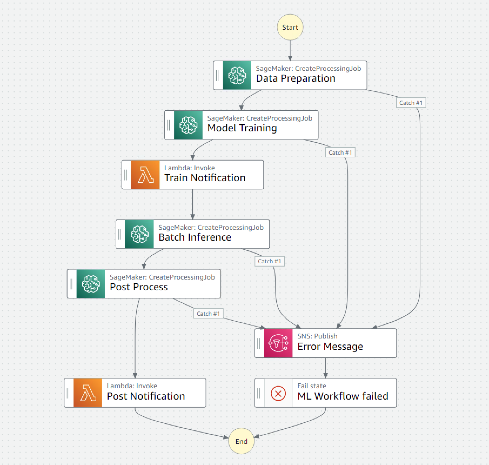
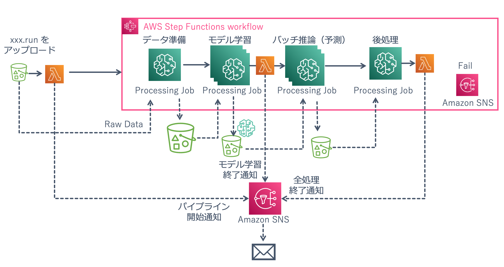

# AutoGluon 並列モデル学習とバッチ推論パイプライン

このサンプルを使って、S3 バケットへのファイルアップロードをトリガーとして実行されるバッチ推論パイプラインを作成することができます。



Raw Data 保存用 S3 バケットの、Raw Data と同じフォルダに拡張子が .run のファイルがアップロードされると、それをトリガーに Lambda 関数が実行され、そこから Step Functions Workflow が実行されます。Step Functions Workflow では、SageMaker Processing を使ってデータの準備、モデルの学習（並列）、バッチ推論（並列）、後処理が順に実行されます。モデルの学習は AutoGluon-Tabular を使用しており、また、モデルの学習が終わった後に評価用データを使ってモデルの評価値（MAE）を算出してファイルに出力しています。バッチ推論スクリプトの中では、前段で学習したモデルの評価値を読み出し、いずれかひとつのモデルの評価値が閾値よりも大きい（性能が良くない）場合は、前段で学習したモデルではなくあらかじめ指定してあるデフォルトモデルを使用して推論を行ないます。Step Functions Workflow 開始時、モデル学習完了時、後処理完了時に Amazon SNS 経由でメールが送信されます。



## 前提条件

このサンプルは、Amazon SageMaker ノートブックインスタンスでの動作を確認しています。ノートブックインスタンスタイプは t3.medium でも動作しますが、コンテナイメージのビルド時間を短縮したい場合は m5.xlarge をご利用ください。コンテナイメージのビルドと Amazon ECR への push に t3.medium だと 20 分程度、m5.xlarge だと 10 分程度かかります。

## 使用する主なサービス

- Amazon SageMaker
- AWS Step Functions
- AWS Lambda
- Amazon SNS
- Amazon ECR
- AWS CodePipeline
- AWS CodeBuild
- AWS CodeCommit

## ファイル構成

```
root
├── code/                  // SageMaker や Lambda で使用するコード
├── docker/                // SageMaker が利用するコンテナイメージ関連ファイル
├── policy/                // 各種リソースで使用する IAM Policy の JSON
├── repo/                  // CodeBuild で使用するファイル一式
├── 00-prepare-container-images.ipynb    // コンテナイメージ作成用ノートブック
├── 01-sagemaker-training-inference-pipeline.ipynb    // ML パイプライン作成用ノートブック
├── 02-create-ml-pipeline-using-codepipeline.ipynb    // ML パイプライン更新パイプライン作成用ノートブック
```

ノートブックは、以下の順番で実行してください。

1. 00-prepare-container-images.ipynb
2. 01-sagemaker-training-inference-pipeline.ipynb
3. 02-create-ml-pipeline-using-codepipeline.ipynb

## サンプルの使い方

ここからは、このサンプルの使い方を詳しく説明します。

### SageMaker で利用するコンテナイメージのビルドと ECR への push

00-prepare-container-images.ipynb を開き、一番初めのセルの `user_name` にご自身の名前（アルファベットで）を記載し、上から順にセルを実行してください。このノートブックでは、SageMaker Processing で使用するコンテナイメージを 2 つビルドして ECR に push しています。それぞれデータ準備および後処理用のコンテナイメージと、モデルの学習および推論用のコンテナイメージです。

### ML パイプラインの作成

01-sagemaker-training-inference-pipeline.ipynb を開き、ノートブックに記載の手順を実行していきます。冒頭の、ブラウザのタブのリロードとカーネルの再起動の手順を忘れずに実行してください。このノートブックでは、S3 へのファイルアップロードをトリガーにして実行される Step Functions Workflow を構築します。このノートブックを実行すると、今回作成したい ML パイプライン全体を作成することができます。

### ML パイプラインを更新するパイプラインの作成

02-create-ml-pipeline-using-codepipeline.ipynb を開き、セルを上から順に実行していきます。このノートブックでは、前のノートブックで作成したコンテナイメージと ML パイプラインを自動的に更新するしくみを作成します。ML パイプラインで使用するインスタンスタイプ、モデル学習の並列数、使用する IAM Role などの各種情報が記載された pipeline-config.yml や、コンテナイメージのビルドと ECR への push を行うシェルスクリプト、Step Functions Data Science SDK を使って ML パイプラインの更新を行う Python スクリプトなどを CodeCommit で管理します。これらのファイルが更新されると、それをトリガーに CodePipeline が起動し、さらに CodeBuild が呼び出されてコンテナイメージの作成と ML パイプラインの更新が実行されます。

## サンプルのカスタマイズ

ここからは、このサンプルをカスタマイズする手順の例を紹介します。

### SageMaker Processing で実行する処理のカスタマイズ

CodeCommit で管理している `code/sagemaker` フォルダ以下にある各 Python ファイルの内容を書き換えます。また、使用したいライブラリがある場合は `docker` フォルダ以下にあるファイルを書き換えて、自身のスクリプトが問題なく動作するコンテナイメージを作成してください。

### ML パイプライン（Step Functions Workflow）のカスタマイズ

CodeCommit で管理している `pipeline.py` を変更して Step Functions Workflow の構築をしてください。試行錯誤段階では、01-sagemaker-training-inference-pipeline.ipynb を使って SageMaker Processing の単体テスト -> Step Functions Workflow の設計 -> Step Functions Workflow の動作確認、の順で実施してからその結果を `pipeline.py` に反映する流れがおすすめです。変更部分が少ない場合は、直接 `pipeline.py` を編集しても問題ありません。

ML パイプライン実行時のパラメタが変化する場合は、上記 `pipeline.py` の他に、同じく CodeCommit で管理している `code/lambda/start-pipeline/index.py` を変更してください。
